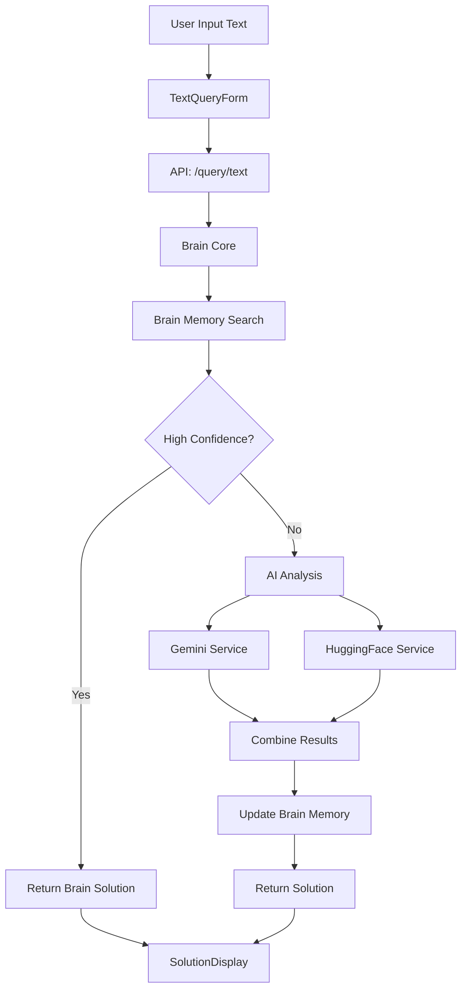
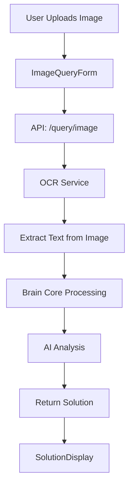
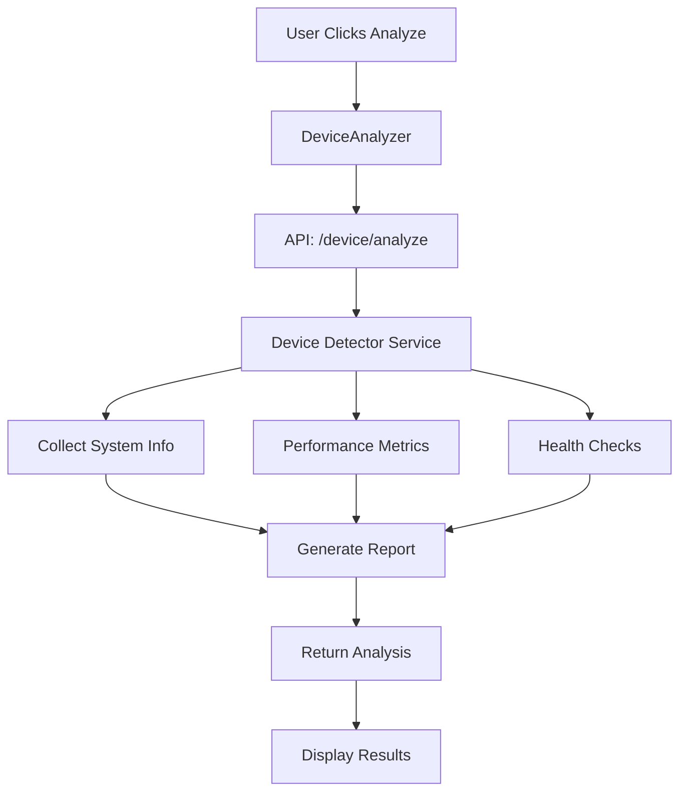

# SmartFix-AI: Intelligent Troubleshooting Assistant

A comprehensive AI-powered troubleshooting platform that provides intelligent solutions for technical issues through multiple input methods including text queries, image analysis, and log file processing.

## 🚀 Project Overview

SmartFix-AI is a full-stack application that combines advanced AI models with a user-friendly interface to deliver intelligent troubleshooting assistance. The system processes various types of input to diagnose and provide step-by-step solutions for technical problems.

### Key Features

- **Multi-modal Input Processing**: Text, image, and log file analysis
- **AI-Powered Solutions**: Integration with Google Gemini and HuggingFace models
- **Brain Memory System**: Intelligent problem-solving with learning capabilities
- **Real-time Notifications**: SMS and WhatsApp integration via Twilio
- **Device Analysis**: Comprehensive system diagnostics and health monitoring
- **Offline Mode**: Local AI model support for offline operation
- **Modern UI**: React-based frontend with Material-UI components

## 📁 Project Structure

```
SmartFix-AI/
├── backend/                    # FastAPI Backend
│   ├── app/                   # Main application package
│   │   ├── api/              # API routes and endpoints
│   │   │   ├── endpoints/    # Individual endpoint modules
│   │   │   │   └── query.py  # Main query processing endpoints
│   │   │   └── api.py        # API router configuration
│   │   ├── core/             # Core configuration and utilities
│   │   │   ├── config.py     # Application settings and environment variables
│   │   │   ├── cache.py      # Caching utilities
│   │   │   ├── security.py   # Authentication & security middleware
│   │   │   ├── monitoring.py # Health monitoring and metrics
│   │   │   └── retry.py      # Retry mechanisms for external services
│   │   ├── services/         # Business logic services
│   │   │   ├── brain_core.py      # Main AI processing engine
│   │   │   ├── brain_memory.py    # Memory system for learning
│   │   │   ├── database.py        # Database operations
│   │   │   ├── gemini_service.py  # Google Gemini AI integration
│   │   │   ├── huggingface_service.py # HuggingFace models integration
│   │   │   ├── twilio_service.py  # SMS/WhatsApp notifications
│   │   │   ├── ocr_service.py     # Image text extraction
│   │   │   ├── serpapi_service.py # Web search integration
│   │   │   └── device_detector.py # System diagnostics
│   │   ├── models/           # Data models and schemas
│   │   │   └── schemas.py    # Pydantic models for API
│   │   ├── database/         # Database models
│   │   │   └── models.py     # SQLAlchemy models
│   │   └── main.py           # FastAPI application entry point
│   ├── requirements.txt      # Python dependencies
│   ├── main.py              # Application entry point
│   └── README.md            # Backend documentation
├── frontend/                 # React Frontend
│   ├── public/              # Static assets
│   │   ├── index.html       # Main HTML template
│   │   ├── manifest.json    # PWA manifest
│   │   └── robots.txt       # SEO robots file
│   ├── src/                 # Source code
│   │   ├── components/      # React components
│   │   │   ├── DeviceAnalyzer.js    # Device analysis component
│   │   │   ├── ImageQueryForm.js    # Image upload form
│   │   │   ├── LogFileForm.js       # Log file upload form
│   │   │   ├── SolutionDisplay.js   # Solution display component
│   │   │   └── TextQueryForm.js     # Text input form
│   │   ├── pages/           # Page components
│   │   │   └── Dashboard.js # Main dashboard page
│   │   ├── services/        # API services
│   │   │   └── api.js       # API client functions
│   │   ├── App.js           # Main App component
│   │   ├── index.js         # React entry point
│   │   └── index.css        # Global styles
│   ├── package.json         # Node.js dependencies
│   └── package-lock.json    # Dependency lock file
├── database/                # Database files
│   └── db.json             # JSON database storage
├── docs/                   # Documentation
│   ├── api_reference.md    # API documentation
│   ├── architecture.md     # System architecture
│   ├── complete_setup.md   # Setup instructions
│   ├── getting_started.md  # Getting started guide
│   ├── implementation_roadmap.md # Development roadmap
│   └── offline_mode.md     # Offline mode documentation
├── env.example             # Environment variables template
├── requirements.txt        # Root requirements file
└── README.md              # This file
```

## 🛠️ Technology Stack

### Backend
- **Framework**: FastAPI (Python 3.8+)
- **Database**: SQLite + JSON file storage
- **AI Models**: Google Gemini, HuggingFace Transformers
- **Image Processing**: PIL, OpenCV, Tesseract OCR
- **Web Search**: SerpAPI
- **Notifications**: Twilio (SMS/WhatsApp)
- **Authentication**: JWT tokens
- **Monitoring**: Custom health checks and metrics

### Frontend
- **Framework**: React 18
- **UI Library**: Material-UI (MUI) v5
- **State Management**: React Hooks
- **HTTP Client**: Axios
- **Animations**: Framer Motion
- **File Upload**: React Dropzone
- **Routing**: React Router DOM

## 🚀 Quick Start

### Prerequisites

- Python 3.8 or higher
- Node.js 16 or higher
- npm or yarn package manager

### 1. Clone the Repository

```bash
git clone <repository-url>
cd SmartFix-AI
```

### 2. Backend Setup

```bash
# Navigate to backend directory
cd backend

# Create virtual environment
python -m venv venv

# Activate virtual environment
# Windows:
venv\Scripts\activate
# macOS/Linux:
source venv/bin/activate

# Install dependencies
pip install -r requirements.txt

# Set up environment variables
cp ../env.example .env
# Edit .env file with your API keys

# Run the backend server
python main.py
```

The backend will start on `http://localhost:8000`

### 3. Frontend Setup

```bash
# Navigate to frontend directory (in a new terminal)
cd frontend

# Install dependencies
npm install

# Start the development server
npm start
```

The frontend will start on `http://localhost:3000`

## ⚙️ Configuration

### Environment Variables

Create a `.env` file in the backend directory with the following variables:

```env
# API Keys
GEMINI_API_KEY=your_gemini_api_key
HUGGINGFACE_API_KEY=your_huggingface_api_key
SERPAPI_API_KEY=your_serpapi_key
TWILIO_ACCOUNT_SID=your_twilio_sid
TWILIO_AUTH_TOKEN=your_twilio_token
TWILIO_PHONE_NUMBER=your_twilio_phone

# Database
DATABASE_URL=sqlite:///./smartfix_ai.db
JSON_DATABASE_PATH=./database/db.json

# Security
SECRET_KEY=your_secret_key_here
ALGORITHM=HS256
ACCESS_TOKEN_EXPIRE_MINUTES=30

# Application Settings
DEBUG=True
LOG_LEVEL=INFO
MAX_FILE_SIZE=10485760  # 10MB
RATE_LIMIT_REQUESTS=100
RATE_LIMIT_WINDOW=3600  # 1 hour

# Service Availability Flags
GEMINI_AVAILABLE=True
HUGGINGFACE_AVAILABLE=True
SERPAPI_AVAILABLE=True
NOTIFICATIONS_AVAILABLE=True
```

### API Keys Setup

1. **Google Gemini API**:
   - Visit [Google AI Studio](https://makersuite.google.com/app/apikey)
   - Create a new API key
   - Add to `GEMINI_API_KEY` in `.env`

2. **HuggingFace API**:
   - Visit [HuggingFace Settings](https://huggingface.co/settings/tokens)
   - Create a new access token
   - Add to `HUGGINGFACE_API_KEY` in `.env`

3. **SerpAPI**:
   - Visit [SerpAPI](https://serpapi.com/)
   - Sign up and get your API key
   - Add to `SERPAPI_API_KEY` in `.env`

4. **Twilio** (Optional):
   - Visit [Twilio Console](https://console.twilio.com/)
   - Get Account SID, Auth Token, and Phone Number
   - Add to respective variables in `.env`

## 🔧 Backend Architecture

### Core Services

#### 1. Brain Core System (`brain_core.py`)
The central processing engine that coordinates all AI services:

```python
class BrainCore:
    def __init__(self):
        self.brain_memory = BrainMemory()
        self.hf_service = HuggingFaceService()
        self.gemini_service = GeminiService()
        self.serp_service = SerpAPIService()
        self.ocr_service = OCRService()
    
    async def process_input(self, input_data: Dict[str, Any]) -> Dict[str, Any]:
        # Main processing pipeline
        processed_text = await self._convert_to_text(input_data)
        brain_solution = self.brain_memory.get_best_solution(processed_text)
        ai_solution = await self._analyze_with_ai(processed_text, input_data)
        final_solution = await self._combine_solutions(brain_solution, ai_solution)
        return final_solution
```

#### 2. Brain Memory System (`brain_memory.py`)
Intelligent memory system that learns from past interactions:

```python
class BrainMemory:
    def __init__(self):
        self.memory_db = SQLiteDatabase("brain_memory.db")
        self.vectorizer = TfidfVectorizer()
    
    def get_best_solution(self, query: str, device_category: str = None) -> Dict:
        # Semantic search through past solutions
        pass
    
    def add_solution(self, problem: str, solution: Dict, success: bool):
        # Learn from successful solutions
        pass
```

#### 3. AI Services Integration

**Gemini Service** (`gemini_service.py`):
```python
class GeminiService:
    async def analyze_problem(self, problem_text: str) -> Dict:
        # Uses Google Gemini for problem analysis
        pass
    
    async def generate_solution(self, problem: str, context: Dict) -> Dict:
        # Generates step-by-step solutions
        pass
```

**HuggingFace Service** (`huggingface_service.py`):
```python
class HuggingFaceService:
    async def text_classification(self, text: str) -> Dict:
        # Classifies problem types
        pass
    
    async def text_summarization(self, text: str) -> str:
        # Summarizes long text inputs
        pass
```

### API Endpoints

#### Query Processing Endpoints

**POST `/api/v1/query/text`**
- Processes text-based troubleshooting queries
- Input: `QueryInput` schema
- Output: `QueryResponse` with solution

**POST `/api/v1/query/image`**
- Processes image-based queries with OCR
- Input: Multipart form with image file
- Output: `QueryResponse` with extracted text and solution

**POST `/api/v1/query/logs`**
- Processes log file analysis
- Input: Multipart form with log file
- Output: `QueryResponse` with log analysis

#### Device Analysis Endpoints

**POST `/api/v1/query/device/analyze`**
- Performs comprehensive device analysis
- Output: System health report with recommendations

**GET `/api/v1/query/device/health`**
- Quick device health check
- Output: Basic health metrics

#### Utility Endpoints

**GET `/api/v1/query/history/{user_id}`**
- Retrieves user's query history
- Output: List of past queries and solutions

**POST `/api/v1/query/notify`**
- Sends SMS/WhatsApp notifications
- Input: `NotificationRequest` schema
- Output: `NotificationResponse`

### Database Schema

#### Query Storage
```sql
CREATE TABLE queries (
    id TEXT PRIMARY KEY,
    user_id TEXT NOT NULL,
    input_type TEXT NOT NULL,
    query_content TEXT,
    solution TEXT,
    status TEXT,
    created_at TIMESTAMP,
    processing_time REAL,
    confidence_score REAL
);
```

#### Brain Memory
```sql
CREATE TABLE brain_memory (
    id INTEGER PRIMARY KEY,
    problem_text TEXT NOT NULL,
    solution_data TEXT NOT NULL,
    device_category TEXT,
    success_count INTEGER DEFAULT 0,
    failure_count INTEGER DEFAULT 0,
    created_at TIMESTAMP,
    last_used TIMESTAMP
);
```

## 🎨 Frontend Architecture

### Component Structure

#### Main Components

**Dashboard** (`pages/Dashboard.js`):
- Main application interface
- Tab-based navigation for different input types
- Solution display and history management

**TextQueryForm** (`components/TextQueryForm.js`):
- Text input for problem description
- Suggestion chips for common issues
- Form validation and submission

**ImageQueryForm** (`components/ImageQueryForm.js`):
- Drag-and-drop image upload
- Image preview and validation
- OCR text extraction display

**LogFileForm** (`components/LogFileForm.js`):
- Log file upload interface
- File type validation
- Processing status display

**SolutionDisplay** (`components/SolutionDisplay.js`):
- Step-by-step solution presentation
- Interactive stepper component
- External resource links
- Notification sharing options

**DeviceAnalyzer** (`components/DeviceAnalyzer.js`):
- System health analysis interface
- Real-time metrics display
- Performance recommendations

### State Management

The application uses React hooks for state management:

```javascript
// Example state structure
const [activeTab, setActiveTab] = useState(0);
const [solution, setSolution] = useState(null);
const [loading, setLoading] = useState(false);
const [userHistory, setUserHistory] = useState([]);
```

### API Integration

**API Service** (`services/api.js`):
```javascript
// Text query submission
export const submitTextQuery = async (textQuery, userId = 'anonymous') => {
  const response = await api.post('/query/text', {
    user_id: userId,
    input_type: 'text',
    text_query: textQuery,
  });
  return response.data;
};

// Image query submission
export const submitImageQuery = async (imageFile, textQuery = '', userId = 'anonymous') => {
  const formData = new FormData();
  formData.append('image', imageFile);
  formData.append('text_query', textQuery);
  formData.append('user_id', userId);
  
  const response = await api.post('/query/image', formData, {
    headers: { 'Content-Type': 'multipart/form-data' },
  });
  return response.data;
};
```

### UI/UX Features

- **Material-UI Components**: Modern, accessible UI components
- **Dark Theme**: Premium dark theme with gradient accents
- **Responsive Design**: Mobile-first responsive layout
- **Animations**: Smooth transitions with Framer Motion
- **Loading States**: Comprehensive loading indicators
- **Error Handling**: User-friendly error messages

## 🔄 Data Flow

### 1. Text Query Processing



### 2. Image Query Processing



### 3. Device Analysis Flow



## 📊 File Operations

### Backend File Handling

#### Image Processing
```python
# OCR Service (ocr_service.py)
def process_image(self, image_data: bytes) -> Dict[str, Any]:
    # Convert bytes to PIL Image
    image = Image.open(io.BytesIO(image_data))
    
    # Extract text using Tesseract
    extracted_text = pytesseract.image_to_string(image)
    
    # Extract error codes
    error_codes = self.extract_error_codes(extracted_text)
    
    return {
        "extracted_text": extracted_text,
        "error_codes": error_codes,
        "confidence": self.calculate_confidence(extracted_text)
    }
```

#### Log File Processing
```python
# Log processing in query endpoints
async def process_log_query(log_file: UploadFile, user_id: str):
    # Read log content
    log_content = await log_file.read()
    log_text = log_content.decode("utf-8", errors="ignore")
    
    # Process with brain core
    input_data = {
        "input_type": "log",
        "log_content": log_text,
        "user_id": user_id
    }
    
    brain_result = await brain_core.process_input(input_data)
    return brain_result
```

### Frontend File Handling

#### Image Upload
```javascript
// ImageQueryForm.js
const handleImageUpload = (acceptedFiles) => {
  const file = acceptedFiles[0];
  if (file) {
    setImageFile(file);
    setImagePreview(URL.createObjectURL(file));
  }
};

const handleSubmit = async (e) => {
  e.preventDefault();
  if (imageFile) {
    const result = await submitImageQuery(imageFile, textQuery, 'test_user');
    onQueryComplete(result);
  }
};
```

#### File Validation
```javascript
// File type validation
const acceptedFileTypes = {
  'image/*': ['.png', '.jpg', '.jpeg', '.gif', '.bmp'],
  'text/*': ['.txt', '.log', '.csv'],
  'application/json': ['.json']
};

// File size validation
const maxFileSize = 10 * 1024 * 1024; // 10MB
```

## 🔐 Security Features

### Authentication & Authorization
- JWT token-based authentication
- Role-based access control (Admin, Technician, User, Guest)
- Rate limiting on API endpoints
- Input validation and sanitization

### Data Protection
- Environment variable configuration
- Secure file upload handling
- SQL injection prevention
- XSS protection

### API Security
```python
# Rate limiting example
@router.post("/notify", dependencies=[Depends(rate_limit_dependency(10, 60))])
async def send_notification(notification: NotificationRequest):
    # Rate limited to 10 requests per 60 seconds
    pass
```

## 📈 Monitoring & Analytics

### Health Monitoring
- System health checks
- Service availability monitoring
- Performance metrics collection
- Error tracking and logging

### Metrics Collection
```python
# Monitoring service
class MonitoringService:
    def collect_metrics(self):
        return {
            "cpu_usage": psutil.cpu_percent(),
            "memory_usage": psutil.virtual_memory().percent,
            "disk_usage": psutil.disk_usage('/').percent,
            "active_connections": len(psutil.net_connections()),
            "timestamp": datetime.now()
        }
```

## 🚀 Deployment

### Backend Deployment

#### Using Docker
```dockerfile
# Dockerfile
FROM python:3.9-slim

WORKDIR /app
COPY requirements.txt .
RUN pip install -r requirements.txt

COPY . .
EXPOSE 8000

CMD ["uvicorn", "main:app", "--host", "0.0.0.0", "--port", "8000"]
```

#### Using Docker Compose
```yaml
# docker-compose.yml
version: '3.8'
services:
  backend:
    build: ./backend
    ports:
      - "8000:8000"
    environment:
      - DATABASE_URL=sqlite:///./smartfix_ai.db
    volumes:
      - ./database:/app/database

  frontend:
    build: ./frontend
    ports:
      - "3000:3000"
    depends_on:
      - backend
```

### Frontend Deployment

#### Build for Production
```bash
cd frontend
npm run build
```

#### Serve with Nginx
```nginx
# nginx.conf
server {
    listen 80;
    server_name your-domain.com;
    
    location / {
        root /var/www/smartfix-ai/build;
        index index.html;
        try_files $uri $uri/ /index.html;
    }
    
    location /api {
        proxy_pass http://localhost:8000;
        proxy_set_header Host $host;
        proxy_set_header X-Real-IP $remote_addr;
    }
}
```

## 🧪 Testing

### Backend Testing
```bash
# Run tests
cd backend
python -m pytest tests/

# Run with coverage
python -m pytest --cov=app tests/
```

### Frontend Testing
```bash
# Run tests
cd frontend
npm test

# Run with coverage
npm test -- --coverage
```

## 📚 API Documentation

### Interactive API Docs
- Swagger UI: `http://localhost:8000/docs`
- ReDoc: `http://localhost:8000/redoc`

### API Examples

#### Text Query
```bash
curl -X POST "http://localhost:8000/api/v1/query/text" \
  -H "Content-Type: application/json" \
  -d '{
    "text_query": "My computer is running slowly",
    "user_id": "user123",
    "input_type": "text"
  }'
```

#### Image Query
```bash
curl -X POST "http://localhost:8000/api/v1/query/image" \
  -F "image=@error_screenshot.png" \
  -F "text_query=Getting this error message" \
  -F "user_id=user123"
```

## 🤝 Contributing

1. Fork the repository
2. Create a feature branch (`git checkout -b feature/amazing-feature`)
3. Commit your changes (`git commit -m 'Add some amazing feature'`)
4. Push to the branch (`git push origin feature/amazing-feature`)
5. Open a Pull Request

## 📄 License

This project is licensed under the MIT License - see the [LICENSE](LICENSE) file for details.

## 🆘 Support

For support and questions:
- Create an issue in the GitHub repository
- Check the documentation in the `docs/` folder
- Review the API documentation at `/docs` endpoint

## 🔮 Roadmap

- [ ] Mobile app development
- [ ] Advanced AI model integration
- [ ] Real-time collaboration features
- [ ] Enhanced device analysis
- [ ] Multi-language support
- [ ] Plugin system for custom integrations

---

**SmartFix-AI** - Making technical troubleshooting intelligent and accessible.
